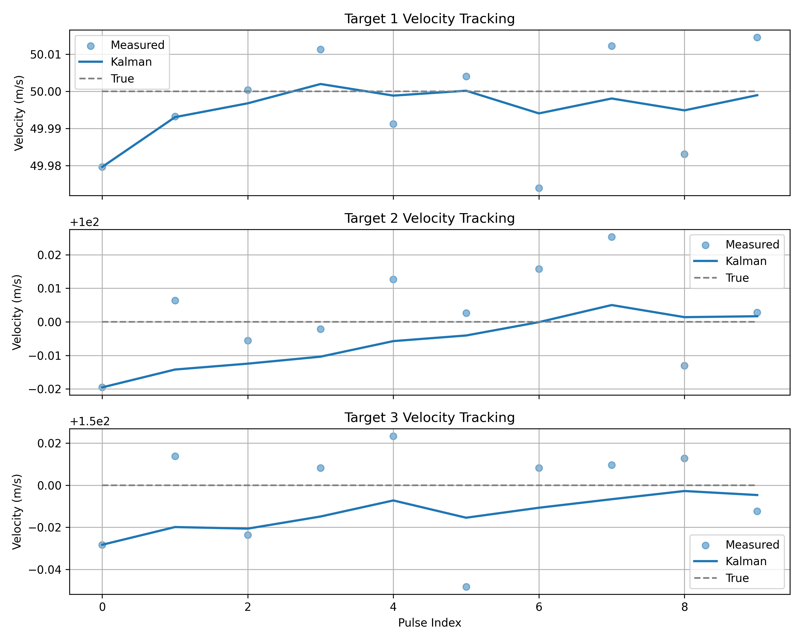
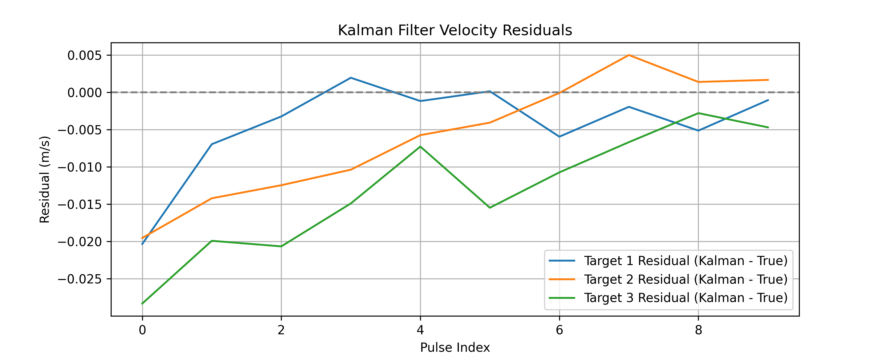
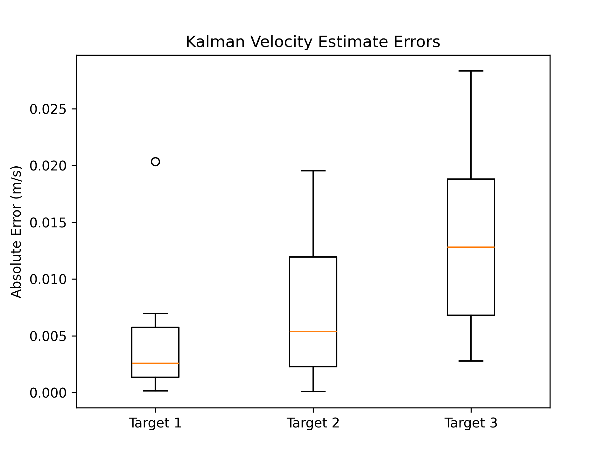

# Multi-Target Doppler Radar Velocity Tracking with Kalman Filtering

This project simulates a radar system tracking multiple targets using Doppler-shifted pulse echos. It estimates each target's velocity using a combination of spectral analysis and Kalman filtering, and compares these estimates to the ground truth.

## Project Overview

The radar emits a series of periodic pulses, which reflect off moving targets. These reflections are Doppler-shifted to estimate target velocity. By processing the received signal in chunks and performing spectral analysis, we extract frequency shifts, estimate velocities, and apply a Kalman filter to smooth out noisy measurements.

### Features:
- Simulated radar pulse emission and reflection from 3 targets.
- Frequency-domain analysis using FFT with sub-bin interpolation.
- Velocity estimation from Doppler shift.
- Kalman filtering for improved velocity tracking.
- Clear comparison of:
  - True vs Measured vs Kalman-estimated velocities
  - Kalman filter residuals and absolute errors

## How It Works

1. **Pulse Simulation**:
   - Emits 10 short pulses at a fixed interval.
   - Each pulse is reflected by multiple moving targets.

2. **Target Motion**:
   - Each target travels at a known constant velocity (used as ground truth).
   - Distance affects signal delay and attenuation.

3. **Signal Processing**:
   - FFT applied on windowed segments of the received signal.
   - Dominant frequency peaks are isolated and interpolated.
   - Doppler shift is converted to velocity.

4. **Kalman Filtering**:
   - A 1D constant velocity Kalman filter is applied to each target’s velocity estimates to reduce measurement noise.

5. **Visualization**:
   - Full pulse space and zoomed-in signal views.
   - True vs Measured vs Kalman-estimated velocities.
   - Kalman filter residuals converging to 0 showing functionality.
   - Box plot of absolute Kalman velocity errors.

## Sample Outputs

| Velocity Tracking | Kalman Residuals | Error Distribution |
|-------------------|------------------|---------------------|
|  |  |  |

## What I Learned

- How to simulate Doppler radar signals with time delay and frequency shift.
- Extracting accurate frequencies from noisy FFTs using sub-bin interpolation.
- Applying and tuning a Kalman filter for tracking noisy measurements.
- Debugging signal-based systems through time-domain visualization.
- Proper purpose and creation of debugging code at major turning points.

## Two-Way Doppler Shift

When a stationary radar emits a pulse at frequency `f0`, a moving target causes two Doppler shifts:

1. **Incoming shift (at the target):**

    ```text
    f' = f0 * (c / (c - v))
    ```

2. **Outgoing shift (back at the radar):**

    ```text
    f_echo = f' * ((c + v) / c)
           = f0 * ((c + v) / (c - v))
    ```

Solving for `v` from the received echo frequency `f_echo`:

```text
f_echo / f0 = (c + v) / (c - v)

v = c * ((f_echo/f0) - 1) / ((f_echo/f0) + 1)

- $f_0$: transmitted frequency  
- $f_{\text{echo}}$: received (reflected) frequency  
- $c$: speed of sound (343 m/s)  
- $v$: target velocity toward the radar

## Struggle
I first made this as a single target pipeline which failed when trying to expand to multi target. I then re-wrote the project from scratch to this multi target version.
I then tried to expand to variable velocity which failed as I would need to rework the frequency searching structure.
I then tried to apply sinusoidal position adjustments which would help simulate variable velocity but ran into similar issues.
These failue points will be a focus of a future project.


## Future Improvements

- Introduce variable velocity (sinusoidal or random walk) targets.
- Handle overlapping echoes and non-uniform sampling.
- Add direction of arrival estimation.
- Extend to full 2D or 3D position tracking.

## Requirements

- Python 3.8+
- NumPy
- Matplotlib
- SciPy